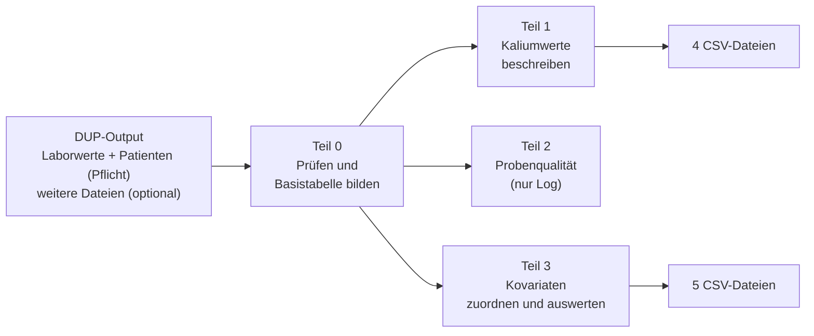

## Beschreibung der Analyse (Kurzfassung)

Das Skript liest die CSV-Dateien der DUP-Pipeline in eine temporäre DuckDB und wertet sie dort in vier Teilen aus.
Es werden nur aggregierte, k-anonymisierte Ergebnisse (k = 5) geschrieben. Einschlusszeitraum: 2019-01-01 bis 2024-12-31.

### Ablauf in Worten

**Teil 0: Vorbereitung.** Das Skript prüft, ob alle erwarteten Spalten und Einheiten vorhanden sind (sonst Abbruch).
Danach entsteht eine Basistabelle mit allen Kaliummessungen im Zeitraum, ergänzt um Alter und Geschlecht.
Doppelte Messungen werden bereinigt und technisch unmögliche Werte (statistischer Ausreißerfilter) entfernt.

**Teil 1: Kaliumwerte beschreiben.** Anzahl Messungen und Patienten, Verlauf pro Monat, Kennzahlen (Mittelwert, Median, Perzentile,
Anteil unter/in/über Referenzbereich) und Verteilung der Werte. Jeweils für alle Patienten sowie getrennt nach Geschlecht und Altersgruppe.

**Teil 2: Probenqualität.** Prüft, ob Hinweise auf Probenqualität (z. B. Hämolyse) vorhanden sind und ob sie sich Kaliumwerten
zuordnen lassen: über Qualitäts-Observations, Bioproben, Notizen und Methoden. Ergebnis steht nur im Log.

**Teil 3: Kovariaten.** Alle Kaliumwerte werden auf mmol/L umgerechnet und als niedrig, normal oder hoch eingestuft.
Danach werden, soweit vorhanden, folgende Informationen jeder Messung zugeordnet:

| Information | Zuordnung (vereinfacht) |
|---|---|
| Fallkontext (stationär/ambulant) | Messung liegt innerhalb eines stationären Falls |
| Folgemessung | nächster Kaliumwert desselben Patienten |
| Weitere Laborwerte (Glukose, Bicarbonat, pH, Kreatinin, GFR) | Messung in der Nähe (± 6 h bzw. ± 48 h) |
| Medikation (Gruppen, die Kalium beeinflussen) | Gabe in den 24 h vor der Messung, teils 12 h danach |
| Dialyse | während, 12 h vor oder 12 h nach der Messung |
| Diagnosen (z. B. Niereninsuffizienz, Diabetes) | während des Falls + 14 Tage |

Darauf aufbauend werden Zählungen (wie oft tritt ein auffälliger Kaliumwert zusammen mit einer Kovariate auf?)
und lineare Regressionen (Einfluss der Kovariaten auf den Kaliumwert, bereinigt um Alter und Geschlecht) berechnet.
Zusätzlich werden Serum- und Blutwerte verglichen, die eng beieinander gemessen wurden, sowie die Veränderung
von Kaliumwerten innerhalb von 6 Stunden ausgewertet.

### Dateien und Abhängigkeiten

| R-Datei | Aufgabe |
|---|---|
| `Main.R` | steuert den Ablauf (Teil 0 → 1 → 2 → 3) |
| `config.R` | Pseudonym, Spaltennamen, Zeitraum, Grenzwerte, Codelisten |
| `Helper_functions.R` | Log, k-Anonymisierung, Prüfungen |
| `Prepare_kalium.R` | Teil 0 |
| `Kalium_value_description.R` | Teil 1 |
| `Evaluate_sample_quality.R` | Teil 2 |
| `Evaluate_covariates.R`, `Loading.R`, `Statistic.R` | Teil 3 (Zuordnung, Laden, Statistik) |

Alle Teile verwenden die Basistabelle aus Teil 0.

### Erzeugte Ausgaben

| Teil | Dateien |
|---|---|
| 1 | `descriptionPotassiumObservations.csv`, `countPotassiumValuesPerMonth.csv`, `statisticsPotassiumValues.csv`, `distributionPotassiumValues.csv` |
| 2 | nur Log |
| 3 | `covariatesCounts.csv`, `covariatesRegression.csv`, `timelineCovariates.csv`, `potassiumNext6h.csv`, `compareSerumBlood.csv` (nur wenn Daten vorhanden) |
| alle | `Kalium360_<Zeitstempel>.log` |

